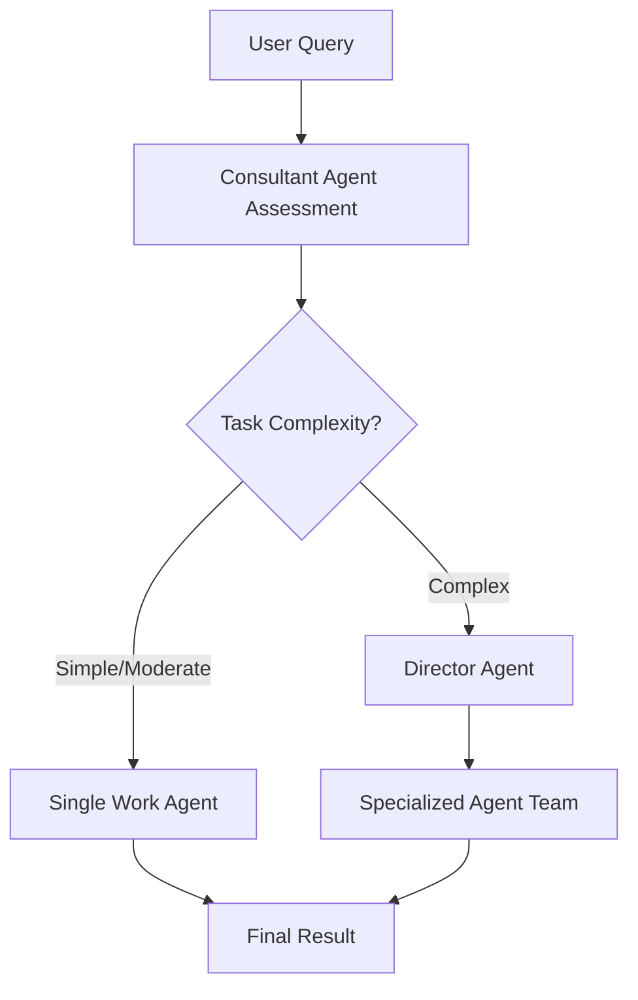

# Default Flow

The Default Flow is an intelligent workflow system that automatically determines the best approach for handling user requests based on task complexity assessment.

## Overview

This flow implements a two-stage decision-making process:

1. **Consultant Agent Assessment**: A consultant agent analyzes the user's request to determine complexity and required capabilities
2. **Intelligent Execution**: Based on the assessment, tasks are executed using either:
   - **Single Work Agent** (for simple, straightforward tasks)
   - **Director-Orchestrated Team** (for complex tasks requiring multiple specialized agents)

## Architecture



## Flow Components

### 1. Consultant Agent
- **Role**: Task Assessment Consultant
- **Responsibility**: Analyze task complexity and determine execution approach
- **Assessment Criteria**:
  - Task complexity (simple, moderate, complex)
  - Required skills and capabilities
  - Whether single agent can handle effectively
  - Recommended execution approach

### 2. Work Agent (Simple Path)
- **Role**: General Work Agent
- **Responsibility**: Execute straightforward tasks efficiently
- **Capabilities**: 
  - Access to basic tools (search, file operations)
  - General problem-solving
  - Direct task completion

### 3. Director Agent (Complex Path)
- **Role**: Team Director
- **Responsibility**: Orchestrate specialized teams for complex tasks
- **Capabilities**:
  - Task decomposition
  - Team assembly
  - Workflow coordination
  - Resource allocation

### 4. Specialized Agents (Complex Path)
- **Research Specialist**: Information gathering and research
- **Data Analyst**: Analysis and insight extraction
- **General Assistant**: Coordination and support

## Usage

### Command Line Interface

```bash
# Run the default flow
fivcadvisor run-flow default

# Generate flow visualization
fivcadvisor plot default

# Show help information
fivcadvisor info
```

### Python API

```python
from fivcadvisor.flows import create_general_flow

# Create and run a flow instance
flow = create_general_flow()
result = flow.kickoff()

# With predefined query
flow = create_general_flow(user_query="What is machine learning?")
result = flow.kickoff()
```

### Example Usage

```python
# Run the example script
python examples/default_flow_example.py
```

## Configuration

The flow can be configured using the `configs/default.yaml` file:

```yaml
# LLM settings
llm:
  model: "openai/gpt-4o-mini"
  temperature: 0.1

# Complexity assessment criteria
complexity_assessment:
  simple_indicators:
    - "what is"
    - "how to"
    - "explain"
  complex_indicators:
    - "analyze"
    - "research"
    - "create"

# Execution thresholds
execution:
  word_count_threshold: 15
  complexity_score_threshold: 2
```

## Examples

### Simple Task Example
**Input**: "What is machine learning?"
**Execution**: Single Work Agent
**Reasoning**: Straightforward definition request

### Complex Task Example
**Input**: "Analyze the current market trends in AI, research competitor strategies, and create a comprehensive business plan for a new AI startup"
**Execution**: Director-Orchestrated Team
**Reasoning**: Requires research, analysis, and strategic planning capabilities

## Flow State Management

The flow maintains state throughout execution:

```python
class GeneralFlowState(BaseModel):
    user_query: str = ""
    assessment: GeneralFlowAssessment = None
    final_result: str = ""
    execution_approach: str = ""
```

## Assessment Model

The consultant agent provides structured assessments:

```python
class GeneralFlowAssessment(BaseModel):
    task_complexity: str  # "simple", "moderate", "complex"
    can_handle_directly: bool
    reasoning: str
    recommended_approach: str  # "worker_direct" or "director_orchestrated"
    required_skills: List[str]
```

## Benefits

1. **Intelligent Resource Allocation**: Automatically selects the most appropriate execution approach
2. **Efficiency**: Simple tasks are handled quickly by single agents
3. **Scalability**: Complex tasks get the specialized attention they need
4. **Transparency**: Clear reasoning for execution decisions
5. **Flexibility**: Easy to extend with new agent types and capabilities

## Future Enhancements

- **Learning from History**: Improve execution decisions based on past performance
- **Dynamic Tool Selection**: Automatically select tools based on task requirements
- **Human-in-the-Loop**: Allow manual override of execution decisions
- **Performance Metrics**: Track and optimize execution accuracy
- **Custom Agent Types**: Support for domain-specific specialized agents

## Prerequisites

1. CrewAI installed with flow support
2. API keys configured (OpenAI, Anthropic, etc.)
3. Required dependencies installed

```bash
pip install crewai crewai-tools
```

## Troubleshooting

### Common Issues

1. **API Key Not Set**: Ensure your LLM API key is configured in `.env`
2. **Import Errors**: Make sure all dependencies are installed
3. **Flow Visualization**: Requires a web browser to view generated HTML files

### Debug Mode

Enable verbose output for debugging:

```bash
hatchery run-flow default --verbose
```

## Contributing

To extend the Default Flow:

1. Add new agent types in `_create_specialized_agents()`
2. Implement new assessment criteria in `_parse_assessment_result()`
3. Add new tools in `_select_tools_for_task()`
4. Update configuration schema in `configs/default.yaml`