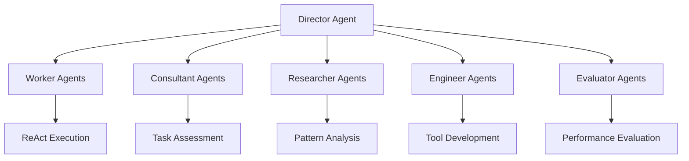

# 🚀 FivcAdvisor

> *An intelligent agent ecosystem for autonomous tool generation, decision optimization, and dynamic crew orchestration*

---

## 📋 Table of Contents

- [🎯 Overview](#-overview)
- [✨ Core Features](#-core-features)
- [🧠 Key Concepts](#-key-concepts)
- [🏗️ Architecture](#️-architecture)
- [🔄 Workflow](#-workflow)

---

## 🎯 Overview

FivcAdvisor is an advanced multi-agent system designed to autonomously generate tools, optimize decision-making processes, and dynamically build specialized crews for complex task execution. The system leverages intelligent agents to create a self-improving ecosystem that adapts and evolves based on task requirements and performance feedback.

---

## ✨ Core Features

### 🛠️ **Tools Generation**
*Autonomous creation and optimization of specialized tools*

- **🔧 Dynamic Tool Creation**
  - Utilize existing code tools to generate new composite tools
  - Automatically combine multiple tool functionalities into cohesive solutions
  - Self-improving tool generation based on usage patterns

- **📊 Intelligent Evaluation System**
  - Deploy evaluation agents for automated tool assessment
  - Human-in-the-loop validation for critical tool decisions
  - Automatic registration of useful tools with performance tracking
  - Time-based cleanup of underperforming tools

- **📈 Task Chain Analysis**
  - Comprehensive logging of agent task execution chains
  - Structured recording and analysis of workflow patterns
  - Code-based summarization of common task sequences
  - Pattern recognition for new tool generation opportunities

### 🎯 **Decision Solidification**
*Optimizing decision-making through intelligent classification*

- **🤖 Classifier Integration**
  - Replace LLM calls with efficient classifiers (Random Forest, etc.)
  - Targeted optimization for specific, well-defined decision scenarios
  - Significant performance improvements for routine decisions

- **🔍 Opportunity Detection**
  - Evaluation agents identify classification opportunities
  - Continuous monitoring for decision pattern recognition
  - Automated recommendation system for optimization candidates

### 👥 **Crew Building**
*Dynamic team assembly and orchestration*

- **🎭 Director-Led Crew Assembly**
  - Intelligent crew composition based on task requirements
  - Dynamic scaling of worker agent teams
  - Skill-based agent selection and assignment

- **📋 Strategic Planning & Execution**
  - Automated workflow and crew planning
  - Dynamic flow creation and execution
  - Real-time crew performance monitoring and adjustment

---

## 🧠 Key Concepts

### 📚 **Core Components**

| Component | Description | Role |
|-----------|-------------|------|
| **📝 Tasks/Crews Logs** | Comprehensive execution tracking | Performance analysis and pattern recognition |
| **🧰 Toolkits** | Centralized tool ecosystem | Tool libraries, retrieval systems, and registration |

### 🤖 **Agent Hierarchy**

#### 🎯 **Agent Types & Responsibilities**

- **👷 Worker Agents**
  - *Standard ReAct agents for task execution*
  - Handle routine operational tasks
  - Execute predefined workflows efficiently

- **💼 Consultant Agents**
  - *Task feasibility and execution specialists*
  - Assess if tasks can be handled by existing tools/flows
  - Escalate complex requirements to Director agents
  - Optimize resource allocation

- **🎭 Director Agents**
  - *Strategic orchestration and team building*
  - Design and assemble specialized crews
  - Break down complex tasks into manageable components
  - Coordinate multi-agent workflows

- **🔬 Researcher Agents**
  - *Pattern recognition and domain analysis*
  - Identify common workflow patterns
  - Analyze task flows within specific domains
  - Generate insights for system optimization

- **⚙️ Engineer Agents**
  - *Tool development and code generation*
  - Create new tools based on identified needs
  - Maintain and optimize existing toolsets
  - Implement system improvements

- **📊 Evaluator Agents**
  - *Performance assessment and quality assurance*
  - Monitor tool and agent performance
  - Provide feedback for continuous improvement
  - Validate new tool effectiveness

---

## 🏗️ Architecture

The FivcAdvisor follows a hierarchical, event-driven architecture that enables autonomous operation while maintaining human oversight capabilities.

### 🔄 **System Flow**
1. **Task Ingestion** → Consultant Agent Assessment
2. **Routing Decision** → Existing Tools vs. New Crew Creation
3. **Crew Assembly** → Director Agent Orchestration
4. **Execution** → Worker Agent Task Completion
5. **Evaluation** → Performance Assessment & Learning
6. **Optimization** → Tool Generation & Process Improvement

---

## 🔄 Workflow

*Detailed workflow documentation and implementation guidelines will be expanded in subsequent iterations based on system development progress.*
